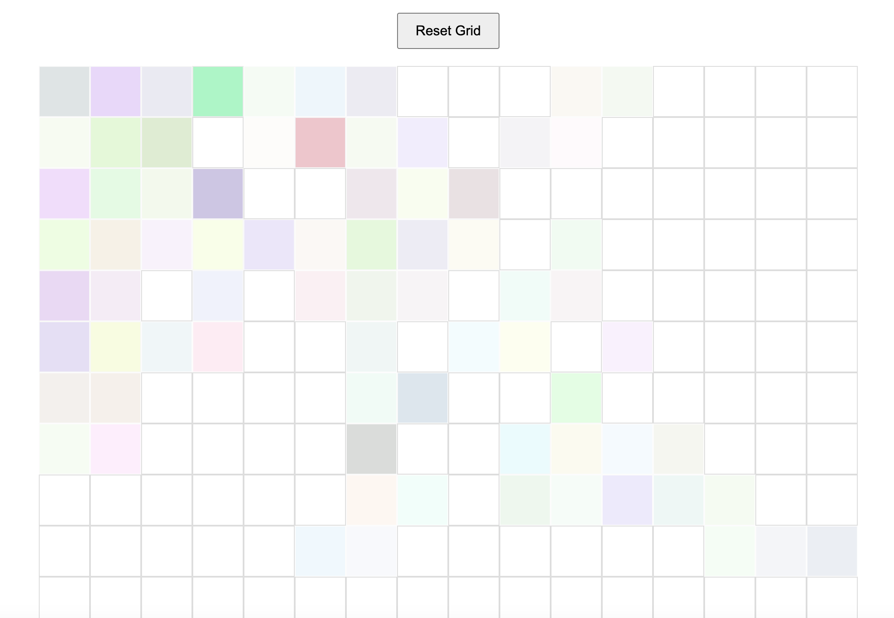

# Interactive Etch-a-Sketch

basic DOM manipulation, event handling, and responsive design.

---

## Link
[link to website](https://juhyeon030330.github.io/Etch-a-Sketch/)

## How to Use
1. Hover your mouse (or drag your finger on mobile) over the grid
2. Click the **Reset** button to wipe the board or change the resolution of your canvas.
3. try to fill all the squares!